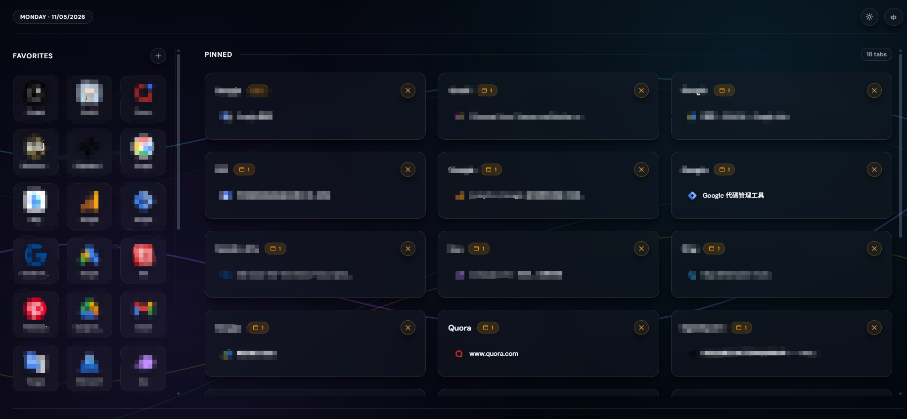
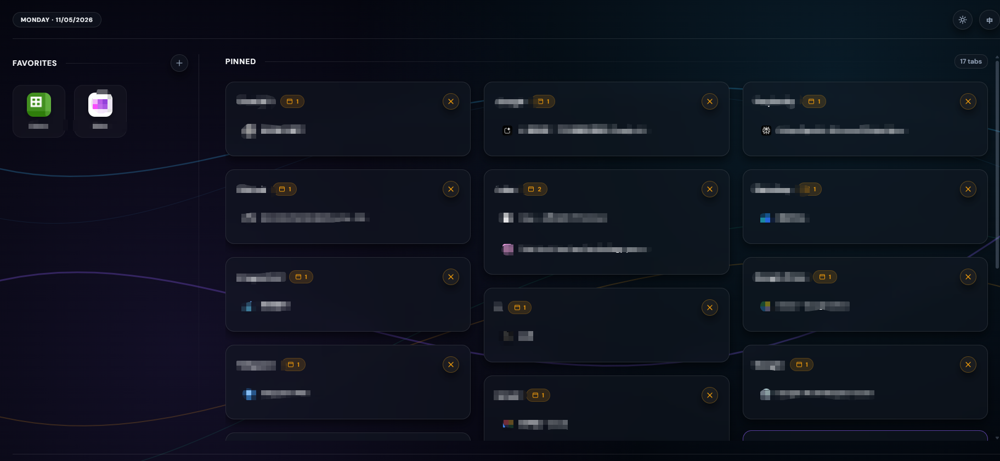
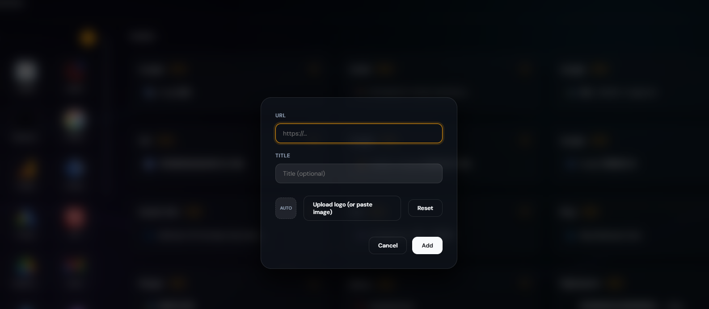

# Chrome Tab

Modern Chrome New Tab Dashboard Extension

---

## Preview







---

## Features

### Modern Dashboard

Clean and modern Chrome new tab experience.

### Quick Access

Fast access to websites, tools, and productivity apps.

### Minimal UI

Simple, responsive, and distraction-free interface.

---

## Installation

1. Open Chrome
2. Visit:

```text
chrome://extensions/
```

3. Enable Developer Mode
4. Click "Load unpacked"
5. Select the extension folder

---

## Tech Stack

- JavaScript
- Chrome Extension API
- HTML
- CSS

---
**支持社区：[LINUX DO](https://linux.do)**

## License

MIT
